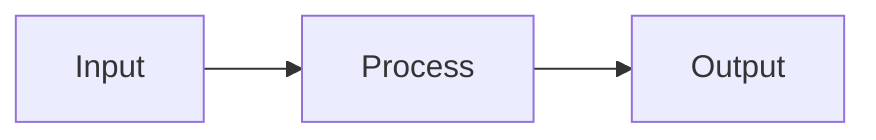

# Unified SDLC Workflow Framework

## Overview
This framework defines a consistent development lifecycle for all projects, emphasizing feature-driven development, comprehensive documentation, session tracking, and intelligent context loading.

## Core Principles

### Working Style
- **Autonomous Execution**: Be persistent - continue until task completion or critical blocker
- **Smart Assumptions**: Document reasonable assumptions and proceed without asking
- **Research-First**: Investigate uncertainties rather than stopping
- **Clear Communication**: Restate goals, outline plans, provide progress updates
- **Feature-Focused**: Every significant change maps to a documented feature

### Documentation Philosophy
- **Living Documents**: Documentation evolves with the code
- **Feature-Driven**: Each capability gets its own documentation set
- **Session Tracking**: Every work session is captured for continuity
- **Context Preservation**: Make it easy to resume work after any interruption

## Standard Project Structure

```
project-root/
├── README.md                      # Project overview, setup, key features
├── .claude/                       # Claude-specific workflows and context
│   ├── project-config.yaml        # Project metadata and preferences
│   ├── sdlc-workflow.md          # This workflow (local copy)
│   └── startup-context.md        # Auto-generated context for sessions
├── docs/
│   ├── features/                 # Feature-by-feature documentation
│   │   ├── index.md             # Feature catalog with status tracking
│   │   └── [feature-name]/
│   │       ├── README.md        # Feature overview and usage
│   │       ├── implementation.md # Technical details
│   │       ├── testing.md       # Test cases and validation
│   │       └── decisions.md     # Design decisions and trade-offs
│   ├── sessions/                 # Session-by-session progress
│   │   └── YYYY-MM-DD/
│   │       ├── notes.md         # Accomplishments, findings, blockers
│   │       └── context.md       # Session-specific context snapshot
│   ├── architecture/            # System design and architecture docs
│   │   ├── overview.md         # High-level system design
│   │   ├── data-flow.md        # Data and state management
│   │   └── dependencies.md     # External dependencies and integrations
│   ├── COMMANDS.md              # Useful commands and patterns
│   ├── TROUBLESHOOTING.md       # Common issues and solutions
│   └── ROADMAP.md               # Future plans and vision
├── scripts/                      # Automation and helper scripts
│   ├── startup.sh               # Session initialization script
│   └── wrap-up.sh              # Session wrap-up automation
└── [source-code-directories]    # Actual project code

```

## Session Startup Protocol

When starting a new work session, the LLM should execute this startup sequence:

### 1. Automatic Context Loading Script

```bash
#!/bin/bash
# scripts/startup.sh - Session initialization script

# Colors for output
GREEN='\033[0;32m'
BLUE='\033[0;34m'
YELLOW='\033[1;33m'
NC='\033[0m'

echo -e "${BLUE}=== SDLC Session Startup ===${NC}"
echo "Date: $(date '+%Y-%m-%d %H:%M')"
echo ""

# 1. Check for project config
if [ -f ".claude/project-config.yaml" ]; then
    echo -e "${GREEN}✓${NC} Project config found"
    PROJECT_TYPE=$(grep "type:" .claude/project-config.yaml | cut -d: -f2 | xargs)
    echo "  Project type: $PROJECT_TYPE"
else
    echo -e "${YELLOW}!${NC} No project config found - using defaults"
    PROJECT_TYPE="generic"
fi

# 2. Generate context file for current session
CONTEXT_FILE=".claude/startup-context.md"
echo -e "${BLUE}Generating session context...${NC}"

cat > "$CONTEXT_FILE" << 'EOF'
# Session Context - Generated $(date '+%Y-%m-%d')

## Project Overview
EOF

# Add README summary if exists
if [ -f "README.md" ]; then
    echo "### From README.md" >> "$CONTEXT_FILE"
    head -n 50 README.md | grep -E "^#|^-|^\*" >> "$CONTEXT_FILE" 2>/dev/null
    echo "" >> "$CONTEXT_FILE"
fi

# Add recent session notes
echo "## Recent Sessions" >> "$CONTEXT_FILE"
LATEST_SESSION=$(ls -d docs/sessions/*/ 2>/dev/null | tail -1)
if [ -n "$LATEST_SESSION" ]; then
    echo "### Last Session: $(basename $LATEST_SESSION)" >> "$CONTEXT_FILE"
    if [ -f "$LATEST_SESSION/notes.md" ]; then
        grep -A 10 "Next Steps" "$LATEST_SESSION/notes.md" >> "$CONTEXT_FILE" 2>/dev/null
    fi
fi

# Add feature status
echo "## Active Features" >> "$CONTEXT_FILE"
if [ -f "docs/features/index.md" ]; then
    grep "🟡" docs/features/index.md >> "$CONTEXT_FILE" 2>/dev/null
fi

# Add current TODOs
echo "## Current TODOs" >> "$CONTEXT_FILE"
if [ -f "docs/ROADMAP.md" ]; then
    grep -A 5 "Current Sprint\|Next Up" docs/ROADMAP.md >> "$CONTEXT_FILE" 2>/dev/null
fi

echo -e "${GREEN}✓${NC} Context file generated at $CONTEXT_FILE"
echo ""
echo -e "${BLUE}Ready to start session!${NC}"
echo "Suggested first steps:"
echo "1. Review the generated context"
echo "2. Check for any incomplete work from last session"
echo "3. Select a feature or task to work on"
```

### 2. LLM Startup Instructions

When beginning a session on a feature or bug:

```markdown
## Session Startup Checklist

When starting work on a feature or bug, follow this sequence:

### Phase 1: Context Loading
1. **Load Project Config**: Read `.claude/project-config.yaml` for project-specific settings
2. **Review Startup Context**: Read `.claude/startup-context.md` for current state
3. **Check Last Session**: Review most recent `docs/sessions/*/notes.md` for continuity
4. **Identify Feature**: Determine which feature(s) will be worked on

### Phase 2: Feature Context Gathering
For the feature(s) being worked on:

1. **Feature Documentation**: Load all docs from `docs/features/[feature-name]/`
2. **Related Features**: Identify and load documentation for dependent features
3. **Architecture Context**: Review relevant `docs/architecture/` files
4. **Test Status**: Check `testing.md` for known issues or pending tests
5. **Decision History**: Review `decisions.md` for constraints and rationale

### Phase 3: Code Context Loading
1. **Implementation Files**: Load key source files mentioned in `implementation.md`
2. **Test Files**: Load relevant test files if they exist
3. **Configuration**: Check for feature-specific config files
4. **Dependencies**: Review package files for relevant dependencies

### Phase 4: Work Planning
1. **Define Scope**: Clearly state what will be accomplished this session
2. **Success Criteria**: Define measurable completion criteria
3. **Risk Assessment**: Identify potential blockers or dependencies
4. **Time Estimate**: Rough estimate for the work
5. **Testing Plan**: How will changes be validated?

### Phase 5: Execution Tracking
During the session:
- Create/update `docs/sessions/YYYY-MM-DD/notes.md` as you work
- Update feature documentation immediately when making design decisions
- Track commands in COMMANDS.md if they're reusable
- Note any issues in TROUBLESHOOTING.md
```

## Feature Development Workflow

### Creating a New Feature

```bash
#!/bin/bash
# scripts/new-feature.sh - Create feature documentation structure

FEATURE_NAME=$1
if [ -z "$FEATURE_NAME" ]; then
    echo "Usage: ./scripts/new-feature.sh <feature-name>"
    exit 1
fi

FEATURE_DIR="docs/features/$FEATURE_NAME"
mkdir -p "$FEATURE_DIR"

# Create README.md
cat > "$FEATURE_DIR/README.md" << EOF
# Feature: $FEATURE_NAME

## Overview
[Brief description of what this feature does]

## Problem Statement
[What problem does this solve?]

## User Interface
[How users interact with this feature]

## Configuration
\`\`\`yaml
# Example configuration
\`\`\`

## Usage Examples
\`\`\`bash
# Example usage
\`\`\`

## Related Features
- [List related features]

## Status
🟡 In Progress - Started $(date '+%Y-%m-%d')
EOF

# Create other files with templates...
echo "✓ Created feature documentation at $FEATURE_DIR"
```

### Feature Documentation Templates

Each feature requires four documentation files:

#### 1. README.md - User-Facing Documentation
```markdown
# Feature: [Feature Name]

## Overview
One paragraph explaining what this feature does and why it exists.

## Problem Statement
- What specific problem does this solve?
- Who experiences this problem?
- What's the impact of not solving it?

## Solution Approach
High-level description of how this feature solves the problem.

## Usage

### Basic Usage
```example
[Simple example]
```

### Advanced Usage
```example
[Complex example with options]
```

## Configuration
| Setting | Type | Default | Description |
|---------|------|---------|-------------|
| option1 | string | "" | Description |

## API Reference
[If applicable, document the API]

## Limitations
- Known limitations
- Planned improvements

## Related Features
- Links to dependent or related features
```

#### 2. implementation.md - Technical Documentation
```markdown
# Implementation: [Feature Name]

## Architecture

### Components
- **Component A**: Purpose and responsibility
- **Component B**: Purpose and responsibility

### Data Flow


## Key Files
| File | Purpose | Key Functions |
|------|---------|---------------|
| file1.js | Main logic | func1(), func2() |

## State Management
How state is managed in this feature.

## Dependencies
- External packages used
- Internal modules required

## Performance Considerations
- Optimization strategies
- Caching approach
- Resource usage

## Security Considerations
- Input validation
- Access control
- Data sanitization
```

#### 3. testing.md - Validation Documentation
```markdown
# Testing: [Feature Name]

## Test Coverage
- Current coverage: X%
- Target coverage: Y%

## Unit Tests
| Test Case | Purpose | Status |
|-----------|---------|--------|
| test1 | Validates X | ✅ Pass |

## Integration Tests
Description of integration test scenarios.

## Manual Testing Procedures
1. Step-by-step testing instructions
2. Expected results at each step

## Edge Cases
- Edge case 1: How it's handled
- Edge case 2: How it's handled

## Performance Tests
- Benchmark results
- Load testing outcomes

## Known Issues
- Issue 1: Description and workaround
- Issue 2: Description and status
```

#### 4. decisions.md - Decision Log
```markdown
# Design Decisions: [Feature Name]

## Decision 1: [Title]
**Date**: YYYY-MM-DD
**Status**: Accepted/Rejected/Superseded

### Context
What was the situation requiring a decision?

### Options Considered
1. **Option A**: Description
   - Pros: 
   - Cons:
2. **Option B**: Description
   - Pros:
   - Cons:

### Decision
Which option was chosen and why.

### Consequences
- Positive outcomes
- Trade-offs accepted
- Future considerations

## Decision 2: [Title]
[Same structure...]
```

## Session Wrap-Up Protocol

When the phrase "wrap this session up" (or variants) is used:

### Automated Wrap-Up Script

```bash
#!/bin/bash
# scripts/wrap-up.sh - Automated session wrap-up

SESSION_DATE=$(date '+%Y-%m-%d')
SESSION_DIR="docs/sessions/$SESSION_DATE"

echo "=== Session Wrap-Up for $SESSION_DATE ==="

# Create session directory
mkdir -p "$SESSION_DIR"

# Generate wrap-up template
cat > "$SESSION_DIR/wrap-up.md" << EOF
# Session Wrap-Up - $SESSION_DATE

## Summary
[Generated by script, to be filled by LLM]

## Metrics
- Files Modified: $(git status --porcelain | wc -l)
- Lines Changed: $(git diff --stat | tail -1)
- Features Touched: [To be filled]

## Next Session
- [ ] Priority 1: 
- [ ] Priority 2:
- [ ] Priority 3:
EOF

echo "✓ Session directory created"
echo "✓ Please complete the wrap-up documentation"
echo "✓ Don't forget to commit and push!"
```

### Manual Wrap-Up Steps

1. **Review Accomplishments**
   ```markdown
   ## Accomplishments
   - ✅ Completed: [What was finished]
   - 🚧 In Progress: [What's partially done]
   - ❌ Blocked: [What couldn't be completed and why]
   - 💡 Discoveries: [Key insights or findings]
   ```

2. **Update Feature Documentation**
   - Update feature status in `docs/features/index.md`
   - Add implementation details to affected features
   - Document any new design decisions
   - Update test status and coverage

3. **Create Session Documentation**
   ```markdown
   # Session Notes - YYYY-MM-DD
   
   ## Focus
   [Primary feature or bug worked on]
   
   ## Changes Made
   - File1: [What changed and why]
   - File2: [What changed and why]
   
   ## Testing Performed
   - [Test type]: [Result]
   
   ## Issues Discovered
   - Issue: [Description]
     - Impact: [Who/what affected]
     - Workaround: [If any]
     - Fix planned: [Yes/No/Later]
   
   ## Next Steps
   1. [Highest priority for next session]
   2. [Second priority]
   3. [Nice to have]
   
   ## Session Metrics
   - Duration: X hours
   - Features touched: N
   - Tests added: N
   - Documentation updated: Y/N
   ```

4. **Update Project Documentation**
   - README.md: Update if capabilities changed
   - ROADMAP.md: Update progress on current sprint
   - COMMANDS.md: Add any useful new commands
   - TROUBLESHOOTING.md: Document any issues/solutions

5. **Commit with Structured Message**
   ```
   [Type] Session YYYY-MM-DD: [Primary accomplishment]
   
   Features:
   - [Feature1]: [What changed]
   - [Feature2]: [What changed]
   
   Documentation:
   - Updated [which docs]
   - Added [what's new]
   
   Testing:
   - [Tests added/modified]
   
   Next: [Primary next step]
   
   Metrics: X files, Y lines changed
   
   Created with Claude Code
   ```
   
   Type prefixes:
   - `[Feature]` - New feature work
   - `[Fix]` - Bug fixes
   - `[Refactor]` - Code improvement without behavior change
   - `[Docs]` - Documentation only
   - `[Test]` - Test additions/improvements
   - `[Build]` - Build system changes

6. **Generate Summary for User**
   ```markdown
   # Session Complete - YYYY-MM-DD
   
   ## Delivered
   - [User-visible change 1]
   - [User-visible change 2]
   
   ## Technical Changes
   - [Internal improvement 1]
   - [Internal improvement 2]
   
   ## Ready for Next Session
   - Starting point: [Where to begin]
   - Prerequisites: [What's needed]
   - Estimated time: [For next chunk]
   
   ## Action Required
   - [ ] [User action if any]
   ```

## Project Configuration

### .claude/project-config.yaml

```yaml
# Project metadata and preferences
project:
  name: "Project Name"
  type: "web|api|cli|library|documentation"
  version: "1.0.0"
  description: "Brief project description"

preferences:
  # Working style
  autonomy_level: "high|medium|low"
  verbosity:
    status_updates: "brief|normal|detailed"
    code_comments: "minimal|normal|comprehensive"
    documentation: "concise|balanced|thorough"
  
  # Development preferences
  testing_strategy: "tdd|bdd|after|manual"
  commit_style: "conventional|descriptive|atomic"
  documentation_style: "minimal|standard|comprehensive"

tech_stack:
  language: "javascript|python|go|rust|java"
  framework: "react|vue|django|fastapi|express"
  testing: "jest|pytest|mocha|vitest"
  build: "vite|webpack|gradle|cargo"

features:
  # Feature flags
  use_startup_context: true
  auto_wrap_up: false
  track_metrics: true
  
conventions:
  # Project-specific conventions
  file_naming: "kebab|snake|camel"
  component_structure: "flat|nested|domain"
  import_style: "absolute|relative|alias"

session_defaults:
  # What to load at session start
  load_recent_sessions: 3
  load_active_features: true
  load_architecture: false
  auto_run_tests: false
```

## Usage Patterns

### Starting a New Session
```bash
# Run startup script
./scripts/startup.sh

# Or manually trigger in conversation:
"Start SDLC session" 
"Initialize feature work on [feature-name]"
"Continue from last session"
```

### During Development
```markdown
Common triggers for documentation updates:
- "Document this decision" → Update decisions.md
- "Add test case" → Update testing.md  
- "Note this issue" → Update TROUBLESHOOTING.md
- "Save this command" → Update COMMANDS.md
```

### Ending a Session
```bash
# Any of these phrases trigger wrap-up:
"wrap this session up"
"let's wrap up"
"finish session"
"use wrap-up protocol"

# Or run script:
./scripts/wrap-up.sh
```

## Integration Tips

### For New Projects
1. Copy this framework to `.claude/sdlc-workflow.md`
2. Run `./scripts/init-sdlc.sh` to create structure
3. Fill in `project-config.yaml` with project specifics
4. Create first feature documentation
5. Start first session with startup protocol

### For Existing Projects
1. Gradually migrate documentation to this structure
2. Start with creating `docs/features/` for new work
3. Begin session tracking immediately
4. Backfill architecture docs as needed
5. Add configuration incrementally

## Benefits

### For Developers
- **Consistent Structure**: Same patterns across all projects
- **Easy Resumption**: Pick up exactly where you left off
- **Clear History**: Understand why decisions were made
- **Faster Onboarding**: New team members understand quickly

### For LLMs
- **Rich Context**: All relevant information loaded automatically
- **Clear Patterns**: Consistent structure to follow
- **Reduced Errors**: Less chance of missing important context
- **Better Continuity**: Maintain context across sessions

### For Projects
- **Living Documentation**: Always up-to-date
- **Traceable Decisions**: Understand the "why" behind code
- **Feature Tracking**: Clear view of what's done/pending
- **Quality Metrics**: Track progress and coverage

## Troubleshooting

### Common Issues

**Issue**: Context file gets too large
**Solution**: Archive older sessions, keep only last 5 in active context

**Issue**: Feature documentation overhead
**Solution**: Use templates, update incrementally, focus on decisions

**Issue**: Merge conflicts in session notes
**Solution**: Each session gets unique directory, conflicts are rare

**Issue**: Forgetting wrap-up protocol
**Solution**: Set reminders, use wrap-up script, make it habit

## Appendix: Quick Reference

### Directory Creation Commands
```bash
# New feature
mkdir -p docs/features/feature-name/{README.md,implementation.md,testing.md,decisions.md}

# New session  
mkdir -p docs/sessions/$(date +%Y-%m-%d)

# Initialize project
mkdir -p {.claude,docs/{features,sessions,architecture},scripts}
```

### Status Indicators
- 🟢 Complete - Feature is done and tested
- 🟡 In Progress - Actively being worked on
- 🔴 Planned - In roadmap but not started
- ⚪ Deprecated - No longer maintained
- 🔵 Experimental - Trying new approach
- 🟣 Refactoring - Improving existing code

### Commit Message Types
- `[Feature]` - New functionality
- `[Fix]` - Bug fixes
- `[Refactor]` - Code improvement
- `[Docs]` - Documentation only
- `[Test]` - Test changes
- `[Build]` - Build/deploy changes
- `[Perf]` - Performance improvements
- `[Style]` - Formatting only
- `[Chore]` - Maintenance tasks

---

*This workflow is designed to evolve. Update it as you discover better patterns.*